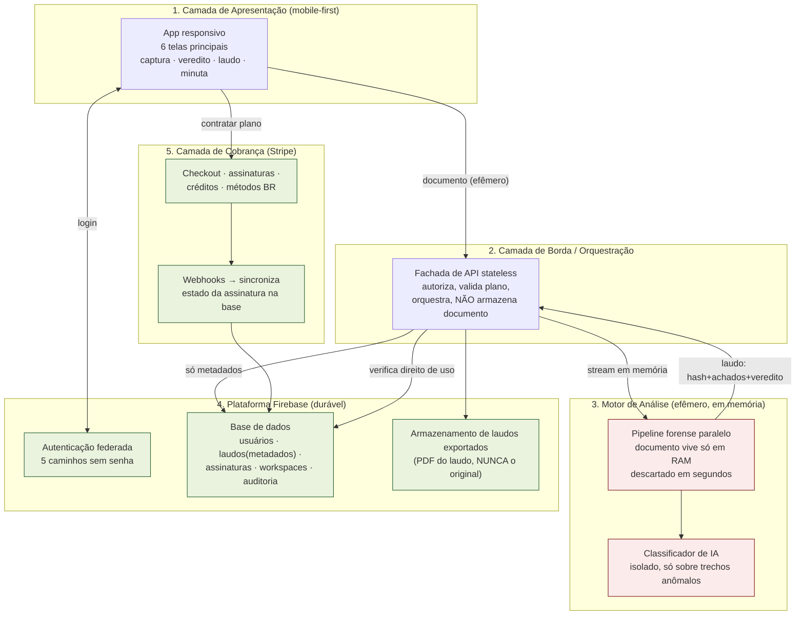
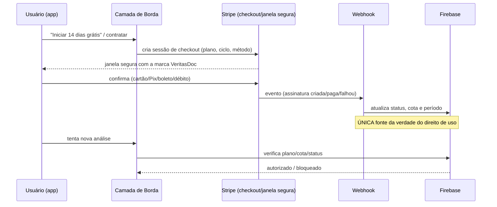

# VeritasDoc — Planejamento de Projeto e Arquitetura

> *A verdade do documento, em segundos.*
> Verificação forense de documentos processuais digitais.
> Documento de planejamento técnico — v1, maio de 2026.

Este documento traduz a *Especificação Completa de Produto v2.1* em um plano de
projeto com arquitetura. Conforme combinado, o foco é a **arquitetura e o plano**,
não a escolha de linguagens ou frameworks. As únicas plataformas fixadas como
requisito de negócio são: **Firebase** como base de dados/identidade, **Stripe**
como gateway de pagamentos desde o primeiro dia, e os **provedores de login social**
(Google, Apple, Microsoft, LinkedIn) mais o link mágico por e-mail. Todo o resto é
descrito por **responsabilidade**, não por produto.

---

## 1. Objetivo do projeto

Entregar uma plataforma multiplataforma (mobile-first) que recebe um documento
processual, o analisa em memória volátil sem nunca armazená-lo, e devolve em
segundos um **veredito em semáforo** + **laudo forense replicável** + **minuta
processual pronta para protocolo**. Monetização por três planos (gratuito,
individual, escritório) e créditos avulsos, com cobrança via Stripe desde o
lançamento.

---

## 2. Princípios arquiteturais inegociáveis

Estes princípios vêm da Seção 5 da especificação e **restringem** todas as
decisões técnicas. Qualquer componente que os viole é recusado.

| # | Princípio | Consequência arquitetural direta |
|---|-----------|----------------------------------|
| 1 | **Zero retenção é arquitetura** | O conteúdo do documento vive apenas em memória volátil do serviço de análise. Nunca toca disco persistente, nunca vai para a base de dados, é descartado em segundos. Auditável. |
| 2 | **Laudo replicável** | Cada achado registra método, localização e critério de forma que um perito reproduza. Sem caixa-preta. |
| 3 | **Determinístico primeiro** | O pipeline executa análises estruturais objetivas; a IA atua só como camada secundária sobre trechos já marcados como anômalos. |
| 4 | **Velocidade percebida** | Veredito inicial < 15s para até 50 páginas. Pipeline paralelo + feedback de progresso em tempo real. |
| 5 | **Mobile não é versão reduzida** | A superfície principal é o smartphone; tablet/desktop só expandem layout. |
| 6 | **O laudo é o produto** | Toda a infraestrutura existe para produzir um único entregável: o laudo. |
| 7 | **Linguagem prudente** | A camada de apresentação e os textos de minuta falam em "indícios", "possível", "recomenda-se verificação". |
| 8 | **Acesso sem fricção** | Login federado sem senha, sem dupla confirmação, sem campo opcional disfarçado. |

> **A decisão mais importante de todo o projeto:** o documento analisado e a base
> de dados (Firebase) **vivem em mundos separados**. O Firebase nunca enxerga o
> conteúdo do arquivo — apenas o resultado da análise (hash, metadados técnicos,
> achados, veredito).

---

## 3. Visão de arquitetura em camadas

A arquitetura é dividida em cinco camadas com responsabilidades estanques. As setas
indicam o fluxo do documento (vermelho/efêmero) e o fluxo de dados persistentes
(azul/durável).

**Por que separar a Borda do Motor?** Porque o app será gerado/prototipado em
ambiente de IA (Google AI Studio), que produz bem a **camada de apresentação**, mas
o **motor forense** e os **webhooks de pagamento** exigem compute stateless próprio.
A fachada de API é a fronteira de segurança e de cobrança: é onde se valida quem é o
usuário, qual o plano, e quantas análises restam — antes de qualquer byte do
documento ser processado.

---

## 4. Modelo de dados no Firebase (o que é e o que NÃO é guardado)

A modelagem é guiada pelo Princípio 1. Abaixo, as coleções persistentes:

| Coleção | Guarda | Nunca guarda |
|---------|--------|--------------|
| `usuarios` | id, e-mail, nome, provedor de login, papel (advogado/magistrado/etc.), aceite de termos, OAB (cadastro progressivo) | senha (não existe), conteúdo de documentos |
| `laudos` | id, dono, hash do documento, metadados técnicos do arquivo, lista de achados (método+local+critério), veredito, pontuação, carimbo de tempo | trechos extensos do documento original |
| `assinaturas` | plano, ciclo, status, id do cliente no Stripe, cota de análises, período | dados completos de cartão (ficam no Stripe) |
| `workspaces` | escritório, membros, papéis/permissões, assentos contratados | — |
| `auditoria` | quem fez o quê, quando (uso da equipe, revogação de sessão) | conteúdo analisado |
| `creditos` | saldo de créditos avulsos, validade | — |

**Regra de ouro de modelagem:** se um campo pudesse reconstruir o documento
original, ele **não existe** no Firebase. O laudo guarda apenas o suficiente para
ser replicável a partir do *mesmo arquivo* fornecido novamente — não a partir da
base.

As regras de segurança da base impõem que:
- um usuário só lê/escreve seus próprios laudos e dados;
- membros de um workspace acessam conforme o papel;
- a cota de análises e o status da assinatura **só** podem ser escritos pela camada
  de borda/webhook (nunca pelo cliente).

---

## 5. Autenticação — os cinco caminhos sem senha

A autenticação usa a identidade federada do Firebase. Mapeamento dos cinco caminhos
da Seção 14:

| Caminho | Suporte | Observação de arquitetura |
|---------|---------|---------------------------|
| 1 · Google | Nativo | Botão principal, topo da tela. Predominante na base. |
| 2 · Apple | Nativo | Obrigatório no app iOS; suporta e-mail de retransmissão. |
| 3 · Microsoft | Nativo | Captura o **domínio corporativo** → dispara oferta de plano escritório e validação institucional (magistrados/defensores/procuradores). |
| 4 · LinkedIn | **Não nativo** | ⚠️ Exige provedor OIDC/custom. Ver risco R-1. |
| 5 · Link mágico no e-mail | Nativo | Menor fricção; link de uso único e validade curta. |

**Cadastro progressivo:** o login coleta só e-mail + nome + aceite de termos. Dados
como número da OAB são pedidos só quando o usuário tenta gerar um laudo assinado;
dados de pagamento, só ao assinar. A camada de apresentação implementa esses
"momentos contextuais".

**Sessão e dispositivos:** sessão longa; tela de configurações lista dispositivos
ativos e permite revogar — cada revogação gera registro em `auditoria`.

**Autenticação reforçada:** ao gerar laudo assinado, confirmação adicional no
dispositivo principal; no plano escritório, o admin pode exigir 2FA da equipe.

---

## 6. Motor de análise forense (o coração efêmero)

O motor recebe o documento da camada de borda como **stream em memória**, executa o
pipeline e devolve **apenas o resultado**. Nenhuma etapa escreve o conteúdo em disco
ou na base.

### 6.1 Pipeline (Seção 7 da especificação)

Executado em paralelo sempre que possível, consolidado ao final:

1. **Coerência entre camadas** — compara a leitura visual e a leitura textual do
   mesmo arquivo; marca o que existe em uma e falta na outra.
2. **Tipográfica e cromática** — texto branco sobre branco, fonte < 4pt, opacidade
   invisível.
3. **Geométrica/posicionamento** — coordenadas fora da área visível, ordem de
   pintura, texto coberto por imagem/retângulo.
4. **Estrutura interna** — anotações, comentários, formulários ocultos, camadas
   opcionais, objetos comprimidos.
5. **Metadados e proveniência** — palavras-chave incomuns, software incompatível,
   datas inconsistentes.
6. **Semântica orientada a intenção** — só sobre trechos já marcados como ocultos:
   dicionário curado → análise de contexto → classificador de IA isolado.
7. **Óptica vs. camada textual** — em digitalizados, compara leitura de imagem com
   texto interno.
8. **Sobreposição** — texto sob elementos opacos, ainda extraível.
9. **Padrões de instrução automatizada** — "ignore instruções anteriores", favorecer
   parte, definir prioridade.
10. **Consistência narrativa** — desvio do gênero esperado da peça.
11. **Proveniência / cadeia de geração** — edição posterior à assinatura digital.
12. **Consolidação** — pondera severidade, quantidade, convergência e contexto.

### 6.2 Determinístico primeiro, IA isolada

A IA **não vê o documento inteiro**. Só recebe trechos já marcados como anômalos
pelas análises estruturais, e sua única função é **classificar intenção**. Isso
respeita o Princípio 3, reduz custo, reduz superfície de risco e mantém o laudo
replicável.

### 6.3 Garantia técnica de zero retenção

- Processamento em ambiente de compute efêmero, idealmente sem disco gravável;
- documento mantido só em buffer de memória, liberado explicitamente ao final;
- nenhum log registra conteúdo — apenas hash, tamanho, duração, veredito;
- o **Modo confidencial reforçado** roda em ambiente isolado dedicado, e descarta
  até o laudo após período definido pelo usuário.

### 6.4 Saída do motor

Estrutura de dados única: `{ hash, metadados, achados[], veredito, pontuacao,
duracao, versaoMetodologia }`. É isso — e só isso — que segue para o Firebase.

---

## 7. Sistema de classificação (semáforo)

Três níveis (Seção 8), com pontuação auxiliar 0–100. Cores da marca:

- 🟢 **Verde** (`1F5C2E`) — sem divergência relevante; pode seguir.
- 🟡 **Amarelo** (`7A4F00`) — achados isolados/ambíguos; cautela.
- 🔴 **Vermelho** (`7A1313`) — pelo menos um achado com padrão de instrução
  automatizada; preservar arquivo e considerar manifestação.

A classificação **não é acusação**; a qualificação jurídica cabe ao usuário, perito
e juízo. Esse tom prudente é responsabilidade da camada de apresentação e dos textos
de minuta.

---

## 8. Integração com Stripe (desde o dia zero)

A cobrança é fixada como Stripe desde o lançamento, com cobertura do mercado
brasileiro.

### 8.1 Catálogo comercial (Seção 16)

| Produto | Preço | Tipo no gateway |
|---------|-------|-----------------|
| Essencial (gratuito) | R$ 0 | sem cobrança; cota de 5 análises/mês na base |
| Individual mensal | R$ 79/mês | assinatura recorrente |
| Individual anual | R$ 758/ano (20% off) | assinatura recorrente |
| Escritório | R$ 59/assento/mês (anual, mín. 5); R$ 49 acima de 20 | assinatura por assento |
| Crédito avulso | R$ 29/análise (val. 12 meses) | cobrança única |
| Pacote 5 créditos | R$ 119 | cobrança única |

### 8.2 Métodos de pagamento (mercado BR)

Cartão de crédito, cartão de débito, **Pix** e **boleto** — todos suportados pelo
gateway no Brasil. Faturamento corporativo via nota fiscal de serviço é exclusivo do
plano escritório (fluxo fora do checkout automático).

### 8.3 Fluxo de cobrança e fronteira de confiança

**Princípio de segurança:** o cliente nunca decide se pode analisar. A camada de
borda **sempre** consulta o status que o **webhook** gravou na base. O app só reflete
o estado; nunca o concede.

### 8.4 Regras de cobrança (Seção 15)

- **Trial 14 dias sem cartão** — entitlement temporário na base, sem cobrança.
- **Ciclos** — mensal (aniversário), anual (desconto), créditos (cobrança única).
- **Falhas** — novas tentativas progressivas, acesso mantido durante regularização,
  suspensão sem perda de histórico, reativação a qualquer momento. Tudo dirigido por
  eventos de webhook.
- **Cancelamento sem fricção** — botão direto, acesso até o fim do ciclo pago.
- **Recibos e NF** — recibo após cada cobrança; NF de serviço automática; histórico
  na área de assinatura.

### 8.5 Princípios permanentes (Seção 16.6)

Nunca cobrar por análise dentro de um plano; nunca diferenciar planos por qualidade
da análise; nunca vender histórico; manter o gratuito perpetuamente útil; trial
generoso sem cartão; cancelamento sem fricção. **Esses princípios são travas de
produto** que a modelagem de cobrança deve respeitar.

---

## 9. Geração do laudo

O laudo é o produto final (Princípio 6). Estrutura (Seção 11): cabeçalho de
identificação, veredito consolidado, sumário visual, descrição detalhada por achado
(método+local+critério), comparativo visual/textual lado a lado, análise de
metadados, descrição metodológica reprodutível, limitações/ressalvas, anexos
técnicos. Formato exportável padronizado para juntada, com cabeçalho VeritasDoc e
rodapé numerado. Nos planos pagos, assinatura digital com selo visível na 1ª página.

O laudo exportado é o **único artefato** que pode ir para o armazenamento durável —
e mesmo ele não contém trechos extensos do original, apenas hash, metadados, achados
e veredito.

A **biblioteca de minutas** (Seção 12) é conteúdo curado preenchido automaticamente
a partir dos achados, em linguagem prudente — manifestação preliminar, requerimento
de preservação, requerimento de perícia com quesitos, notificação extrajudicial,
requisição de ata notarial, etc.

---

## 10. Multiplataforma

- **Smartphone (principal)** — as 6 telas do protótipo: boas-vindas/autenticação,
  hub inicial, processamento, veredito, detalhe do achado, assinatura/pagamento.
- **Tablet** — 3 colunas (lista · documento com destaques · achados); alterna entre
  leitura humana e leitura plena; triagem em lote ampliada.
- **Desktop** — janela única com barra lateral; análise em lote; comparador de duas
  colunas com linhas-guia; workspace compartilhado no plano escritório.

Mesma identidade visual em todas: azul-marinho (`0F2A4A`) institucional, bronze
(`8B6914`) nos acentos, cores semafóricas restritas ao veredito, serifada no
logotipo + sans-serif na interface.

---

## 11. Privacidade, LGPD e segurança (Seção 13)

- **Conteúdo** — só memória volátil; nunca disco persistente; descartado em segundos.
- **Laudo** — só hash, metadados, achados, veredito.
- **Modo confidencial reforçado** — ambiente isolado, laudo autodescartável.
- **LGPD** — bases legais, papéis controlador/operador e direitos do titular em
  documentação contratual.
- **Sigilo profissional / segredo de justiça** — a não retenção é compatível por
  construção.
- A promessa de zero retenção deve ser **auditável**: logs que comprovem que nenhum
  byte do conteúdo foi persistido.

---

## 12. Roadmap de implementação

Alinhado à Seção 18, traduzido em ordem de construção técnica.

### Fase 0 — Fundação (antes de qualquer feature)
- Projeto Firebase + os 4 provedores de login nativos + link mágico.
- Esqueleto da camada de borda (fachada de API stateless) + regras de segurança da
  base.
- Conta Stripe + catálogo de produtos/preços + **webhook** sincronizando assinatura
  na base. *(Stripe presente "desde o momento 0", como pedido.)*
- App de apresentação no ambiente de IA com as 6 telas e o fluxo de login.

### Fase 1 — Lançamento (≈60 dias)
- App web responsivo com fluxo essencial completo.
- **Todos os métodos determinísticos** de análise (itens 1–5 e 7–11 do pipeline).
- 5 caminhos de autenticação operacionais (resolver LinkedIn — ver R-1).
- Stripe ativo: Essencial grátis, Individual com trial, Escritório por contato,
  créditos avulsos.
- Geração de laudo exportável + biblioteca de minutas.

### Fase 2 — Apps nativos (3–4 meses)
- iOS/Android, compartilhamento nativo, captura por câmera (OCR), modo confidencial
  em todas as plataformas.

### Fase 3 — Escritório (6 meses)
- Workspace compartilhado, gestão centralizada, auditoria, painel admin,
  faturamento corporativo (boleto/NF).

### Fase 4 — Integrações (12 meses)
- Extensão de navegador, integrações com sistemas de gestão jurídica, acordos com
  tabelionatos, tratativas com tribunais.

---

## 13. Riscos e decisões em aberto

| Id | Risco / decisão | Encaminhamento sugerido |
|----|-----------------|--------------------------|
| R-1 | **LinkedIn não é provedor nativo** da identidade Firebase | Implementar como provedor OIDC/custom token via camada de borda, ou adiar LinkedIn para depois do MVP mantendo os 4 nativos no lançamento. **Decisão necessária.** |
| R-2 | **Motor forense não roda no ambiente de IA** nem no cliente | Construir como serviço de compute stateless separado, chamado pela camada de borda. O ambiente de IA cuida só da apresentação. |
| R-3 | **Zero retenção × tentação de cache** | Proibir, por regra de arquitetura e revisão, qualquer cache/log de conteúdo. Auditoria periódica. |
| R-4 | **Pix/boleto recorrente** têm particularidades no gateway | Validar capacidade de recorrência por método no Brasil antes de prometer "Pix recorrente". |
| R-5 | **Veredito < 15s para 50 páginas** | Paralelizar o pipeline e medir desde a Fase 1; é requisito de produto (Princípio 4). |
| R-6 | **Assinatura digital do laudo** | Definir provedor/padrão de assinatura aceito para juntada processual. |
| R-7 | **Validação institucional** (magistrados/defensores) via domínio | Definir lista de domínios confiáveis e fluxo de verificação. |

---

## 14. Resumo de uma página

VeritasDoc é, antes de tudo, uma **promessa de não reter** transformada em
arquitetura. O documento entra, é dissecado em memória por um pipeline determinístico
(com IA só para classificar trechos suspeitos), e sai como **veredito + laudo +
minuta** — enquanto o **Firebase guarda apenas a evidência do resultado**, nunca o
documento. A identidade é federada e sem senha (cinco caminhos), e o **Stripe está
presente desde o dia zero** como única fonte da verdade sobre o direito de uso,
sincronizado por webhook. O mobile é a superfície principal; tablet e desktop apenas
expandem. Cada decisão futura passa pela moldura dos oito princípios da Seção 5.
